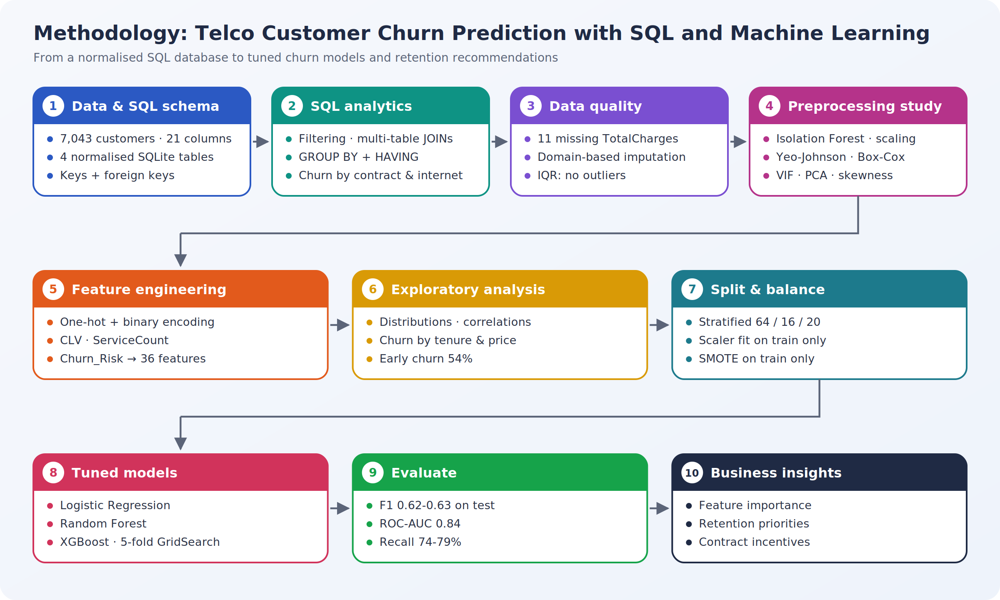
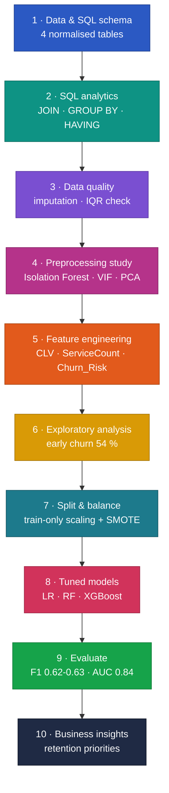
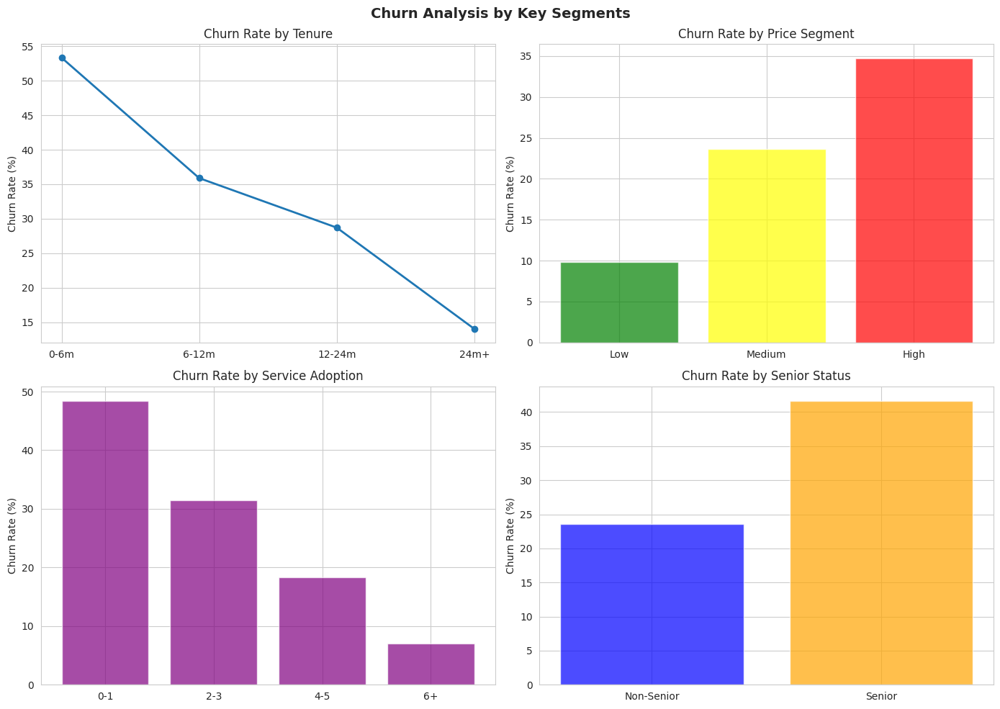
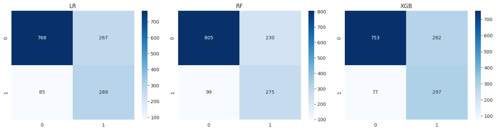
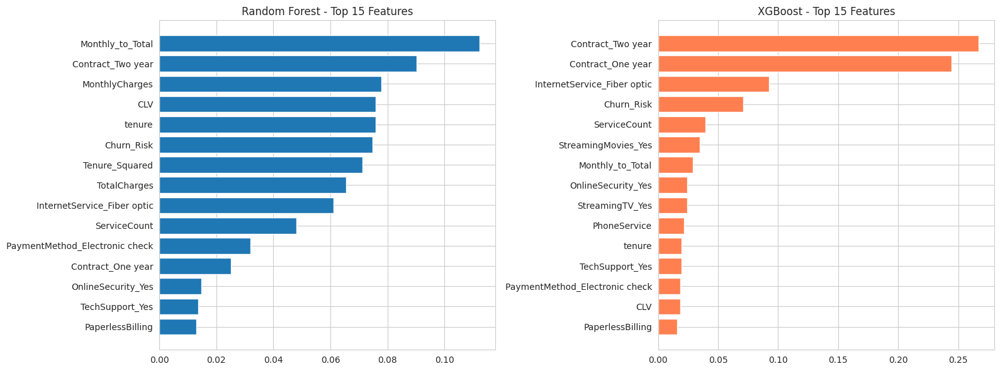

# Telco Customer Churn Prediction with SQL and Machine Learning

An end-to-end churn workflow for **7,043 telecom customers**: a normalised **SQLite** database and analytical SQL queries, a structured study of preprocessing techniques, business-driven feature engineering, and grid-searched **Logistic Regression, Random Forest and XGBoost** models turned into retention recommendations.

> MSc Data Science project, University of Hertfordshire. All results come from one complete run in Google Colab.

---

## Highlights

| | |
|---|---|
| **SQL pipeline** | 4 normalised tables (customers, services, contracts, billing) with foreign keys; JOIN, GROUP BY and HAVING queries |
| **Models** | Logistic Regression, Random Forest, XGBoost, each tuned with 5-fold grid search on F1 |
| **Test performance** | **F1 0.62-0.63**, **ROC-AUC 0.84**, **recall 74-79 %** on 1,409 held-out customers |
| **Leak-safe preparation** | Stratified split; scaler and SMOTE fitted on the training split only |
| **Key insight** | Customers in their first 6 months churn at **54 %**; month-to-month contracts at **43 %** vs **3 %** for two-year contracts |

## Methodology

**[Explore the interactive methodology](https://spoorthihs4-ops.github.io/telco-churn-sql-ml/)** – click any stage to see what it does, why it matters, the result it produced and the techniques behind it.

<b>Pipeline as a live diagram (zoom and pan on GitHub)</b>

## Results

### Model comparison (held-out test set, 1,409 customers)

| Model | Accuracy | Precision | Recall | F1 | ROC-AUC |
|---|---|---|---|---|---|
| Logistic Regression | 0.750 | 0.520 | 0.773 | 0.622 | **0.844** |
| Random Forest | **0.767** | **0.545** | 0.735 | **0.626** | 0.838 |
| XGBoost | 0.745 | 0.513 | **0.794** | 0.623 | 0.842 |

The three models are practically tied. All were tuned for F1 with class balancing, so they trade precision for recall and catch three out of four churners - the right trade-off when a retention offer costs less than a lost customer. The simple Logistic Regression is as good as the ensembles and is the easiest to explain.

### Who churns

| Segment | Churn rate |
|---|---|
| All customers | 26.5 % |
| Tenure under 6 months | **54.3 %** |
| Tenure 24 months or more | 14.3 % |
| Month-to-month contract | 43 % |
| One-year contract | 11 % |
| Two-year contract | 3 % |
| Month-to-month, fibre optic | 55 % |

  
  

  

### Retention recommendations

1. Focus retention effort on the first six months of the customer lifecycle.
2. Offer incentives to move month-to-month customers to annual contracts.
3. Encourage service bundling to increase add-on adoption (see churn by service adoption in the segment analysis).
4. Score customers regularly and target high-risk segments proactively.

## Notebooks

| Notebook | Contents |
|---|---|
| [`00_full_pipeline_run_all`](00_full_pipeline_run_all.ipynb) | **Everything, top to bottom - run this to reproduce** |
| [`01_data_and_sql_pipeline`](01_data_and_sql_pipeline.ipynb) | Data loading, SQLite schema, data import, four analytical SQL queries |
| [`02_preprocessing_study`](02_preprocessing_study.ipynb) | Data quality, imputation, outliers, scaling, power transforms, VIF and PCA |
| [`03_feature_engineering_and_eda`](03_feature_engineering_and_eda.ipynb) | Encoding, engineered features, univariate, correlation and segment analysis |
| [`04_modelling_evaluation_insights`](04_modelling_evaluation_insights.ipynb) | Split and SMOTE, tuned models, comparison, feature importance, business insights |

The schema and queries are also available as plain SQL in [`telco_churn.sql`](telco_churn.sql).

## Reproduce

1. Download the [IBM Telco Customer Churn dataset](https://www.kaggle.com/blastchar/telco-customer-churn) as `Telcochurn.csv`.
2. Open [`00_full_pipeline_run_all.ipynb`](00_full_pipeline_run_all.ipynb) in **Google Colab** and upload the CSV when prompted.
3. **Run All.** The whole notebook runs in a few minutes on a standard CPU runtime.

## Limitations and next steps

- Model selection uses test-set F1, and the models differ by less than 0.005 F1; cross-validated confidence intervals would show whether any is genuinely better.
- The validation split is not yet used; it is the natural place to tune the decision threshold against the cost of a retention offer.
- SHAP explanations for individual customers would make the model more useful for targeted campaigns.

## Repository structure

All files sit in the repository root so they upload and display correctly:

- `00_full_pipeline_run_all.ipynb` – the complete pipeline (run this to reproduce)
- `01_…` onwards – part notebooks with executed outputs
- `methodology_flowchart.png` and the result charts shown above
- `index.html` – interactive methodology page (GitHub Pages)
- `requirements.txt`, `.gitignore`
- `telco_churn.sql` – schema and analytical queries

## Author

**Dr. Spoorthi H S** · MSc Data Science, University of Hertfordshire  
[LinkedIn](https://linkedin.com/in/dr-spoorthi-2005b6351) · [GitHub](https://github.com/spoorthihs4-ops)
